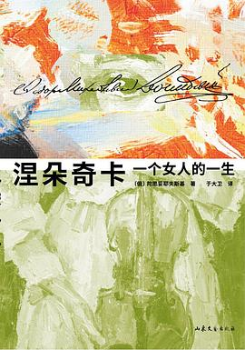

## 内容简介  · · · · · ·
### 【编辑推荐】

◆陀思妥耶夫斯基高分神作，绝版半个多世纪，全新回归。

◆王小波读完终生难忘：“我看了这本书，而且终生记住了前半部。我到现在还认为这是一本最好的书，顶得上大部头的名著。我觉得人们应该为了它永远纪念陀思妥耶夫斯基。”

◆豆瓣9.1分——千人好评，万人想读，终于再版。

◆全新译本——豆瓣9.5分《安娜·卡列尼娜》译者于大卫俄语直译，力求贴合原作语言风格。

◆全彩插画——俄罗斯艺术家伊利亚·格拉祖诺夫国家美术馆亲自授权，书中名场面一一再现。

◆万字导读——北京大学俄语教授赵桂莲，原创深度长文剖析《涅朵奇卡》背后的深意。

◆精装典藏——新锐设计师操刀，圆脊精装，精巧小开本，轻盈便携。

·

### 【内容简介】

1848年，陀思妥耶夫斯基开始创作《涅朵奇卡》。

1849年，他被流放西伯利亚，之后中断了创作，导致这部小说未完成。

在这本书里：

他写一个被浪费的天才，人生不可空过，颓废太久，天赋就会被收走；

他写一个傲娇女友，少年时建立的情谊比世上任何东西都要单纯、珍贵；

他写一个少女的成长，为了保护珍视的人，懦弱的女孩也敢挺身而出。

·

### 【名人推荐】

◆我看了这本书，而且终生记住了前半部。我到现在还认为这是一本最好的书，顶得上大部头的名著。我觉得人们应该为了它永远纪念陀思妥耶夫斯基。我永远也忘不了叶菲莫夫的遭遇，它使我日夜不安。并且我灵魂里好像从此有了一个恶魔，它不停地对我说：人生不可空过，伙计！——王小波

◆在我看到《绿毛水怪》之前，刚好看过这本书，印象极为深刻，而且一直觉得这是我内心的秘密。没想到竟在小波的小说中看到了如此相似的感觉，当时就有一种内心秘密被人看穿之感。——李银河